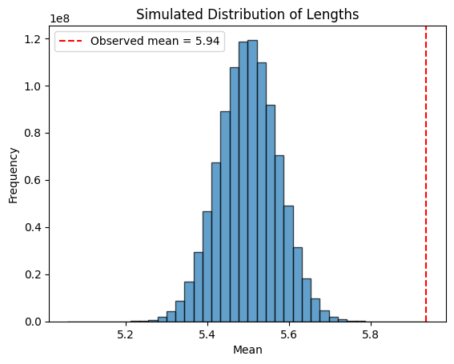
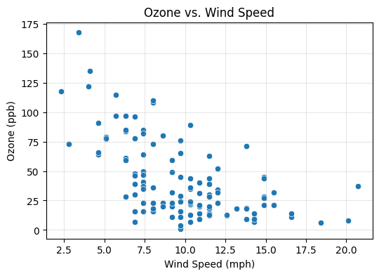
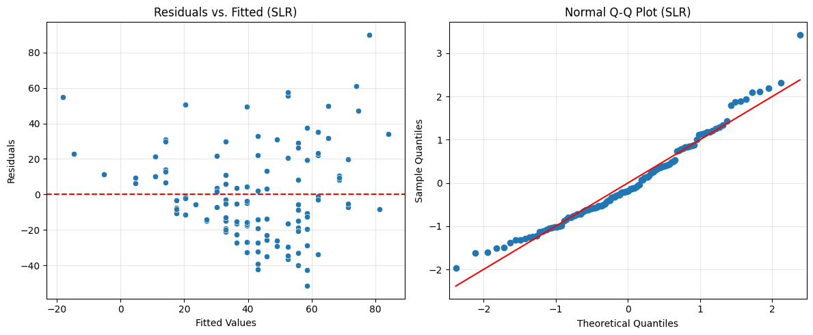

```python
import numpy as np
import pandas as pd
import seaborn as sns
import matplotlib.pyplot as plt
from sklearn.datasets import load_iris
import statsmodels.formula.api as smf
import statsmodels.api as sm
```

# Problem 1

### Hypothesis Testing using Simulation (10 pts)
The dataset iris contains measurements on three species of iris flowers. In this assignment, you’ll focus only on the 50 observations with Species == "versicolor". Complete both of the following tasks and report results and interpretations.
A botanist claims that the average sepal length of her Iris versicolor plants is 5.5 cm. You will test this claim via simulation.


```python
iris = load_iris(as_frame=True)
df = iris.frame
df=df[df['target'] == 1] # only versicolor
observed_mean = df['sepal length (cm)'].mean()
print(observed_mean)
```

    5.936


```python
observed_mean = df['sepal length (cm)'].mean()
num_simulations = 1_000_000_000
n = len(df)
sample_std = df['sepal length (cm)'].std(ddof=1)
print(sample_std)

CLAIMED_MEAN = 5.5

simulated_means = np.random.normal(loc=CLAIMED_MEAN, scale=sample_std/np.sqrt(n), size=num_simulations)

```

    0.5161711470638635


```python
observed_diff = np.abs(observed_mean - CLAIMED_MEAN)

extreme_count = np.sum(np.abs(simulated_means - CLAIMED_MEAN) >= observed_diff)

p_value = extreme_count / num_simulations
print(f"p-value: {p_value}")
```

    p-value: 2e-09


```python
plt.hist(simulated_means, bins=40, alpha=0.7, edgecolor='black')
plt.axvline(observed_mean, color='red', linestyle='--', label=f'Observed mean = {observed_mean:.2f}')
plt.title("Simulated Distribution of Lengths")
plt.xlabel("Mean")
plt.ylabel("Frequency")
plt.legend()
plt.show()
```


    

    


# Intepretation and Results

The actual observed mean of the data was 5.94 cm with a standard deviation of 0.516 cm.

In order to test the assumption that the true mean was 5.5, I ran 10,000,000 simulations. This resulted in a p-value of about 2e-9 Since this is dramatically less than 0.05, we **reject the null hypothesis** that the true mean is 5.5.

# Problem 2


### Simple linear regression: investigate if wind speed largely explains ozone variation

a. Initial exploration - make a scatterplot and calculate correlation coefficient to identify the strength of their relationship.


```python
df = pd.read_csv('airquality.csv')
df.columns
plt.figure(figsize=(6, 4))
sns.scatterplot(x='Wind', y='Ozone', data=df)
plt.title('Ozone vs. Wind Speed')
plt.xlabel('Wind Speed (mph)')
plt.ylabel('Ozone (ppb)')
plt.grid(True, alpha=0.3)
plt.show()

correlation_slr = df['Wind'].corr(df['Ozone'])
print(f"Correlation (Ozone vs. Wind): {correlation_slr:.3f}")
```


    

    


    Correlation (Ozone vs. Wind): -0.602


b. Fit a model, write down the fitted model and interpret: the coefficient estimates, model performance.


```python
print("\nb. Fit Model & Interpretation (SLR)")
slr_model = smf.ols('Ozone ~ Wind', data=df).fit()
print(slr_model.summary())

# Fitted model equation
intercept_slr = slr_model.params['Intercept']
slope_wind_slr = slr_model.params['Wind']
print(f"\nFitted Model: Ozone_pred = {intercept_slr:.3f} + ({slope_wind_slr:.3f}) * Wind")

```

    
    b. Fit Model & Interpretation (SLR)
                                OLS Regression Results                            
    ==============================================================================
    Dep. Variable:                  Ozone   R-squared:                       0.362
    Model:                            OLS   Adj. R-squared:                  0.356
    Method:                 Least Squares   F-statistic:                     64.64
    Date:                Tue, 29 Apr 2025   Prob (F-statistic):           9.27e-13
    Time:                        21:08:05   Log-Likelihood:                -543.59
    No. Observations:                 116   AIC:                             1091.
    Df Residuals:                     114   BIC:                             1097.
    Df Model:                           1                                         
    Covariance Type:            nonrobust                                         
    ==============================================================================
                     coef    std err          t      P>|t|      [0.025      0.975]
    ------------------------------------------------------------------------------
    Intercept     96.8729      7.239     13.383      0.000      82.533     111.213
    Wind          -5.5509      0.690     -8.040      0.000      -6.919      -4.183
    ==============================================================================
    Omnibus:                        9.324   Durbin-Watson:                   1.608
    Prob(Omnibus):                  0.009   Jarque-Bera (JB):                9.327
    Skew:                           0.678   Prob(JB):                      0.00943
    Kurtosis:                       3.303   Cond. No.                         31.1
    ==============================================================================
    
    Notes:
    [1] Standard Errors assume that the covariance matrix of the errors is correctly specified.
    
    Fitted Model: Ozone_pred = 96.873 + (-5.551) * Wind


This equation shows that as wind speed increases, the amount of ozone concentration decreases. When wind speed is zero, the ozone concentration is 96.873. The very low p values for these values indicates that these are stastistitically significant relationships.

However, the low R^2 value of 0.362 indicates that this is not a very strong model. This suggests that windspeed is not enough to predict ozone concentration.

c. Predict the ozone concentration when wind = 10 mph.


```python
wind_value = 10
predicted_ozone_slr = slr_model.predict(pd.DataFrame({'Wind': [wind_value]}))
prediction = f'{predicted_ozone_slr.iloc[0]:.3f}'

print(f"Predicted Ozone at Wind = {wind_value} mph: {prediction}")

```

    Predicted Ozone at Wind = 10 mph: 41.364


d. Check model assumptions using diagnostic plots.


```python
residuals_slr = slr_model.resid
fitted_slr = slr_model.fittedvalues

fig, axes = plt.subplots(1, 2, figsize=(12, 5))

sns.scatterplot(x=fitted_slr, y=residuals_slr, ax=axes[0])
axes[0].axhline(0, color='red', linestyle='--')
axes[0].set_title('Residuals vs. Fitted (SLR)')
axes[0].set_xlabel('Fitted Values')
axes[0].set_ylabel('Residuals')
axes[0].grid(True, alpha=0.3)

sm.qqplot(residuals_slr, line='s', ax=axes[1], fit=True)
axes[1].set_title('Normal Q-Q Plot (SLR)')
axes[1].grid(True, alpha=0.3)

plt.tight_layout()
plt.show()
```


    

    


The diagnostic plots confirm my interpretation that wind speed alone is insufficient to predict ozone concentration. The residuals plot displays considerable scatter patterns, which supports the model's low R^2 value of 0.362.

Additionally, the Q-Q plot shows deviations from the reference line, supporting my interpretation that more factors are needed for the model.

### Multiple Linear regression: include wind speed, temperature and solar radiation to improve predictions
a. Multicollinearity check using pairwise correlation plot.

b. Fit a model, write down the fitted model and interpret: the coefficient estimates, model performance.

c. Check model assumptions using diagnostic plots.
