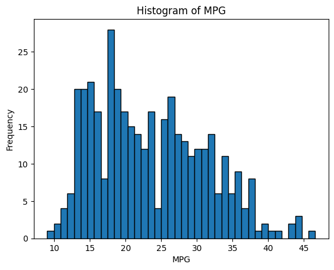
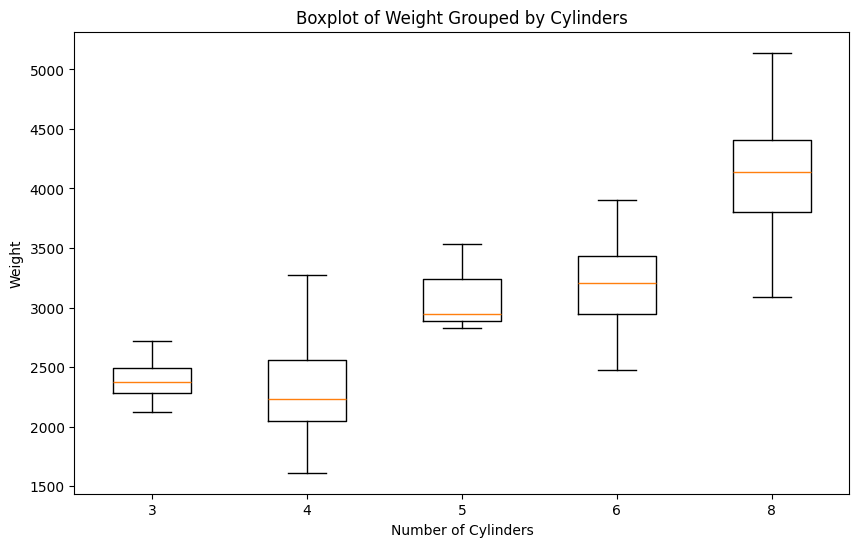

# Part 1: Summary Statistics (10pts)

i. Overall Analysis
a. Calculate the mean, median, and standard deviation for:

mpg
horsepower
weight

ii. Grouped Analysis
a. Group the data by origin and calculate for each region:

Average mpg
Average horsepower
Average weight

b. Which region has the most fuel-efficient cars on average?
# Part 2: Data Visualization (15pts)
i. Univariate Analysis
a. Create a histogram of mpg

What is the most common range of fuel efficiency?

b. Create a boxplot of weight grouped by cylinders

What trends do you observe in vehicle weight based on the number of cylinders?

ii. Bivariate Analysis
a. Create a scatterplot of horsepower vs mpg

Does higher horsepower generally relate to lower fuel efficiency?

b. Create a scatterplot of weight vs mpg

Discuss the relationship between vehicle weight and fuel efficiency

iii. Trend Analysis
a. Create a line plot of average mpg over model year

How has fuel efficiency changed over time?


```python
import pandas as pd
import numpy as np
data_file = './mpg.csv'
df = pd.read_csv(data_file)
df.columns
```


    Index(['Unnamed: 0', 'mpg', 'cylinders', 'displacement', 'horsepower',
           'weight', 'acceleration', 'model_year', 'origin', 'name'],
          dtype='object')


# Part 1

## Main Analysis


```python
mpg_mean = df['mpg'].mean()
mpg_median = df['mpg'].median()
mpg_std = df['mpg'].std()

horespower_mean = df['horsepower'].mean()
horespower_median = df['horsepower'].median()
horespower_std = df['horsepower'].std()

weight_mean = df['weight'].mean()
weight_median = df['weight'].median()
weight_std = df['weight'].std()
```


```python
print("MPG")
print("Mean: ", mpg_mean)
print("Median: ", mpg_median)
print("Standard Deviation: ", mpg_std)

print()
print("Horsepower")
print("Mean: ", horespower_mean)
print("Median: ", horespower_median)
print("Standard Deviation: ", horespower_std)

print()
print("Weight")
print("Mean: ", weight_mean)
print("Median: ", weight_median)
print("Standard Deviation: ", weight_std)
```

    MPG
    Mean:  23.445918367346938
    Median:  22.75
    Standard Deviation:  7.8050074865717995
    
    Horsepower
    Mean:  104.46938775510205
    Median:  93.5
    Standard Deviation:  38.49115993282849
    
    Weight
    Mean:  2977.5841836734694
    Median:  2803.5
    Standard Deviation:  849.4025600429492


```python
print(df['origin'].unique())
```

    ['usa' 'japan' 'europe']


## Group by Region


```python
usa = df[df['origin'] == 'usa']
japan = df[df['origin'] == 'japan']
europe = df[df['origin'] == 'europe']

usa_mpg_mean = usa['mpg'].mean()
usa_horsepower_mean = usa['horsepower'].mean()
usa_weight_mean = usa['weight'].mean()

japan_mpg_mean = japan['mpg'].mean()
japan_horsepower_mean = japan['horsepower'].mean()
japan_weight_mean = japan['weight'].mean()

europe_mpg_mean = europe['mpg'].mean()
europe_horsepower_mean = europe['horsepower'].mean()
europe_weight_mean = europe['weight'].mean()

```


```python
print("USA")
print("MPG Mean: ", usa_mpg_mean)
print("Horsepower Mean: ", usa_horsepower_mean)
print("Weight Mean: ", usa_weight_mean)

print()
print("Japan")
print("MPG Mean: ", japan_mpg_mean)
print("Horsepower Mean: ", japan_horsepower_mean)
print("Weight Mean: ", japan_weight_mean)

print()
print("Europe")
print("MPG Mean: ", europe_mpg_mean)
print("Horsepower Mean: ", europe_horsepower_mean)
print("Weight Mean: ", europe_weight_mean)

print()
if usa_mpg_mean > japan_mpg_mean and usa_mpg_mean > europe_mpg_mean:
    effecient_country = "USA"
elif japan_mpg_mean > usa_mpg_mean and japan_mpg_mean > europe_mpg_mean:
    effecient_country = "Japan"
else:
    effecient_country = "Europe"
print(f"Country with the most efficient cars: {effecient_country}")
```

    USA
    MPG Mean:  20.0334693877551
    Horsepower Mean:  119.04897959183674
    Weight Mean:  3372.4897959183672
    
    Japan
    MPG Mean:  30.450632911392404
    Horsepower Mean:  79.83544303797468
    Weight Mean:  2221.227848101266
    
    Europe
    MPG Mean:  27.602941176470587
    Horsepower Mean:  80.55882352941177
    Weight Mean:  2433.470588235294
    
    Country with the most efficient cars: Japan


# Part 2


```python
import matplotlib.pyplot as plt

plt.hist(df['mpg'], bins=40, edgecolor='black')
plt.title('Histogram of MPG')
plt.xlabel('MPG')
plt.ylabel('Frequency')
plt.show()

counts, bin_edges = np.histogram(df['mpg'], bins=40)

# bin with biggest freq
max_index = np.argmax(counts)
most_common_range = (bin_edges[max_index], bin_edges[max_index + 1])

print(f"The most common MPG range is from {most_common_range[0]} to {most_common_range[1]}")
```


    

    


    The most common MPG range is from 17.46 to 18.4


```python
groups = df.groupby('cylinders')['weight'].apply(list)

cylinder_groups = [groups[c] for c in sorted(groups.index)]

plt.figure(figsize=(10, 6))
plt.boxplot(cylinder_groups, labels=sorted(groups.index))
plt.title('Boxplot of Weight Grouped by Cylinders')
plt.xlabel('Number of Cylinders')
plt.ylabel('Weight')
plt.show()

print("The weight of the vehicle tends to increase with the number of cylinders")
```

    /var/folders/kp/vdv61pd97vd0x29b257r8h7h0000gn/T/ipykernel_93159/3010619427.py:6: MatplotlibDeprecationWarning: The 'labels' parameter of boxplot() has been renamed 'tick_labels' since Matplotlib 3.9; support for the old name will be dropped in 3.11.
      plt.boxplot(cylinder_groups, labels=sorted(groups.index))


    

    


    The weight of the vehicle tends to increase with the number of cylinders


```python

```
