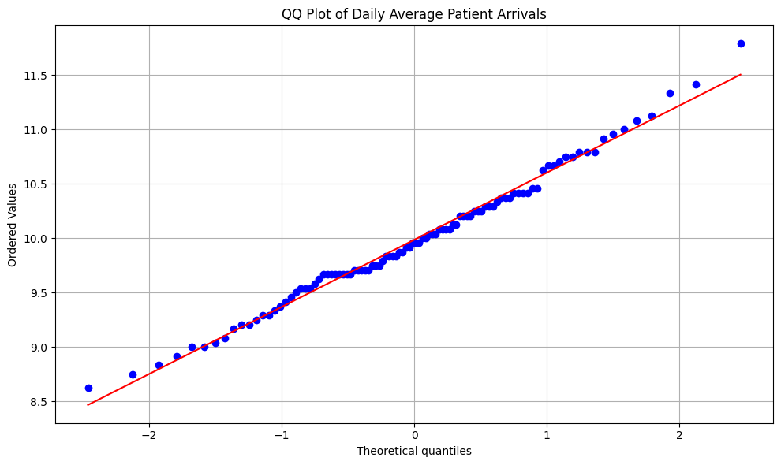
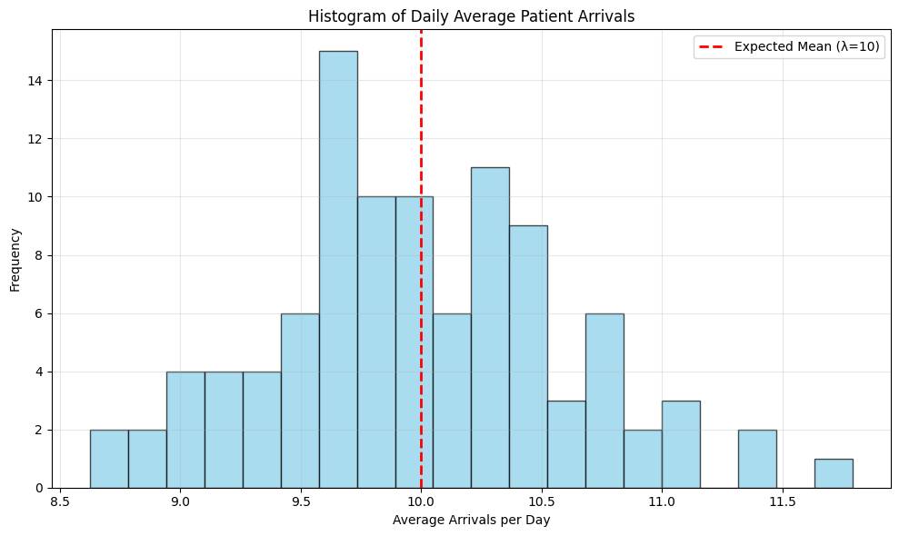
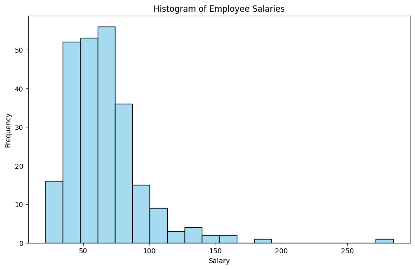
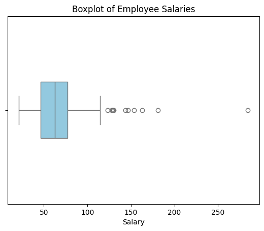

# Setup


```python
import pandas as pd
import numpy as np
import matplotlib.pyplot as plt
import seaborn as sns
import scipy as stats
from scipy.stats import probplot, shapiro
np.random.seed(42)
from numpy.random import default_rng


```

# Problem 1
An emergency room (ER) receives patients randomly throughout the day. The number of patients arriving per hour follows a Poisson distribution with parameter 10 (10 patients per hour). Due to hospital capacity limitations, the ER becomes overcrowded when more than 15 patients arrive in a single hour. You will simulate patient arrivals and estimate probabilities related to ER overcrowding.

i.	Use simulation to estimate the probability that the ER experiences overcrowding (more than 15 patients in an hour).


```python
def simulate_hours(lambda_param, hours):
    return np.random.poisson(lambda_param, hours)

lambda_param = 10
n = 1*10*7
poisson = simulate_hours(lambda_param, n) 
overcrowding_prob = np.mean(poisson > 15)

print(f"Estimated probability of ER overcrowding: {overcrowding_prob:.4f}")
```

    Estimated probability of ER overcrowding: 0.0857


ii.	Simulate 100 days, each consisting of 24 hours of patient arrivals, estimate the proportion of days where the ER is overcrowded for at least 4 hours.


```python
simulations = []
lambda_param = 10
days = 100
hours = 24
for i in range(days):
    poisson = simulate_hours(lambda_param, hours)
    simulations.append(poisson)

crowded_days = 0
for day in simulations:
    crowded_hours = 0
    for hour in day:
        if hour > 15:
            crowded_hours += 1
    if crowded_hours >= 4:
        crowded_days += 1
        
print(crowded_days/days)
```

    0.01


iii.	Using the data simulated in the previous question, compute the mean of 24 hourly arrivals in each day, then you will have 100 average arrivals. Compare it to a normal distribution using QQ plot.


```python
daily_means = np.array([np.mean(day) for day in simulations])

plt.figure(figsize=(10, 6))

probplot(daily_means, dist="norm", plot=plt)

plt.title('QQ Plot of Daily Average Patient Arrivals')
plt.grid(True)
plt.tight_layout()

plt.figure(figsize=(10, 6))
plt.hist(daily_means, bins=20, alpha=0.7, color='skyblue', edgecolor='black')
plt.axvline(lambda_param, color='red', linestyle='dashed', linewidth=2, label=f'Expected Mean (λ={lambda_param})')
plt.title('Histogram of Daily Average Patient Arrivals')
plt.xlabel('Average Arrivals per Day')
plt.ylabel('Frequency')
plt.grid(True, alpha=0.3)
plt.legend()
plt.tight_layout()

plt.show()
```


    

    


    

    


# Problem 2

You are given a dataset containing the annual salaries (in $1000s) of 250 employees in a company. The dataset is stored as a csv file(employee_salaries.csv).

i.	Load the dataset and visualize the distribution of salaries using a histogram and a boxplot.


```python
df = pd.read_csv('employee_salaries.csv')
plt.figure(figsize=(10, 6))

sns.histplot(df['Salary (in $1000s)'], bins=20, color='skyblue', edgecolor='black')
plt.title('Histogram of Employee Salaries')
plt.xlabel('Salary')
plt.ylabel('Frequency')
plt.show()

sns.boxplot(x='Salary (in $1000s)', data=df, color='skyblue', width=0.3)
plt.title('Boxplot of Employee Salaries')
plt.xlabel('Salary')
plt.show()

```


    

    


    

    


ii.	Compute the observed sample mean, median, and standard deviation of salaries.


```python
mean = df['Salary (in $1000s)'].mean()
median = df['Salary (in $1000s)'].median()
std = df['Salary (in $1000s)'].std()

print(f"Mean: {mean:.2f}")
print(f"Median: {median:.2f}")
print(f"Standard Deviation: {std:.2f}")
```

    Mean: 65.79
    Median: 62.37
    Standard Deviation: 29.12


iii.	Bootstrap estimation of the bias for the median:
a.	Perform 1,000 bootstrap resamples (sampling with replacement from the dataset)
b.	Compute the bootstrap median for each resample


```python
n_bootstraps = 1000
bootstrap_medians = np.zeros(n_bootstraps)
salaries = df['Salary (in $1000s)'].values
rng = default_rng(42)


for i in range(n_bootstraps):
    # Generate bootstrap sample (with replacement)
    bootstrap_sample = rng.choice(salaries, size=len(salaries), replace=True)
    
    # Calculate the median of the bootstrap sample
    bootstrap_medians[i] = np.median(bootstrap_sample)
print(bootstrap_medians)
```

    [62.59317019 60.42718467 62.34736438 62.59317019 62.19018674 62.44837942
     61.63154753 60.58449623 61.13363628 57.10682449 62.94035728 63.35690052
     62.19018674 58.34884275 62.39779863 61.30875267 60.58449623 62.03300911
     62.8384253  62.03300911 62.48900746 61.03718662 56.55277776 59.09394871
     60.42718467 65.00491065 63.67595051 62.39779863 65.44972359 62.53958825
     65.2342883  61.13363628 59.14446433 55.46154039 62.03300911 60.04579354
     62.46379033 62.50196136 59.14446433 63.32428673 60.32852931 62.03300911
     66.84251908 60.42718467 62.66907796 60.58449623 60.17121775 61.6922755
     61.13363628 62.21540387 66.13081644 60.32852931 63.23012041 63.19750662
     62.4231623  62.19018674 59.09394871 64.45511941 62.53958825 64.77553299
     57.90761148 61.03718662 62.44837942 63.07072651 59.16359168 64.77553299
     61.23008595 62.6061241  60.04579354 62.95225151 65.2579462  66.35873551
     63.18975749 63.07072651 60.81084142 65.02856854 62.77324069 61.03718662
     60.05917796 58.34884275 62.3725815  62.58021628 63.18975749 62.34736438
     61.03718662 63.38951432 59.12276618 60.15783333 61.81394229 62.77324069
     62.26598466 60.04579354 63.19750662 60.04579354 62.59317019 60.81084142
     61.23008595 60.04579354 63.18975749 59.06256045 65.02856854 62.94035728
     62.59317019 63.38951432 62.21540387 59.16359168 56.47707607 62.3725815
     62.3725815  60.58449623 62.94035728 64.77553299 59.16359168 62.34736438
     62.55254216 63.06505739 62.44837942 65.02856854 62.77324069 59.1732818
     64.22574175 63.18975749 60.07256238 64.77553299 62.77324069 58.16948964
     65.47360989 62.59317019 62.49896022 56.47707607 62.3195666  65.2579462
     63.32428673 62.48900746 61.63154753 59.1732818  63.18975749 59.09394871
     60.58449623 63.18975749 63.19750662 60.81084142 62.94035728 58.65271744
     62.8384253  62.3725815  57.37097478 63.67595051 57.63512506 60.15783333
     61.30861875 62.6061241  63.32428673 63.32428673 62.39779863 62.49896022
     63.0055419  60.42718467 66.39013599 59.09394871 62.39779863 62.94035728
     62.34736438 62.53958825 62.94035728 63.18975749 61.63154753 62.39779863
     63.0055419  61.15144111 60.31514488 60.32852931 58.62132917 60.58449623
     62.49896022 62.71965875 62.58021628 62.8979408  63.06505739 59.16359168
     62.59317019 63.130242   61.63154753 62.03300911 63.35690052 63.130242
     59.09394871 62.77324069 65.90289738 65.2579462  60.42718467 62.6061241
     58.62132917 63.53273242 55.74631253 63.38951432 60.81084142 65.60524279
     63.0055419  64.77553299 62.19018674 61.03718662 62.39779863 63.23012041
     58.1800979  65.31809069 65.29984739 60.15783333 62.94035728 63.38951432
     62.76028678 62.34736438 62.3725815  60.04579354 60.81084142 65.28160409
     57.10682449 60.42718467 53.93588628 61.13363628 62.26598466 63.07072651
     64.22574175 61.23008595 60.65352987 60.42718467 60.17121775 63.35690052
     58.15888138 60.05917796 59.61438272 62.58021628 62.26598466 62.19018674
     62.58021628 62.44837942 65.76601323 60.04579354 63.130242   59.11307607
     63.0055419  62.19018674 59.09394871 65.29984739 60.17121775 62.03300911
     65.2579462  62.94035728 63.37333851 62.03300911 61.13363628 61.03718662
     62.77324069 63.38951432 59.60469261 59.18297191 62.66907796 63.130242
     62.8384253  60.58449623 62.44837942 63.38951432 56.82980113 61.13363628
     61.13363628 59.06256045 59.16359168 62.34736438 63.130242   62.03300911
     57.90761148 59.61438272 60.58449623 59.87404396 61.13363628 61.53509786
     60.31514488 62.44837942 60.81084142 57.01824972 63.50011862 62.34736438
     59.06256045 65.00491065 63.53273242 59.60469261 62.39779863 62.39779863
     63.0055419  62.77324069 62.58021628 62.77324069 62.53958825 64.45511941
     59.14446433 62.96520541 62.44837942 56.47707607 62.46379033 63.38951432
     62.49896022 66.63202778 61.13363628 60.81084142 62.44837942 65.45536659
     62.3725815  57.37097478 62.94035728 62.49896022 65.44972359 62.58021628
     60.15783333 59.1732818  62.19018674 62.3725815  62.59317019 61.78872516
     65.29984739 62.39779863 63.0055419  62.53958825 60.42718467 60.58449623
     61.23008595 60.90729109 59.62776714 62.53958825 64.45511941 62.6061241
     64.31190131 60.42718467 62.59317019 62.94035728 62.39779863 60.90729109
     59.61438272 62.59317019 61.53509786 63.38951432 61.13363628 63.130242
     63.53273242 61.78872516 59.18297191 61.13363628 62.6061241  64.77553299
     63.32428673 62.6061241  62.19018674 61.81394229 63.19750662 62.94035728
     59.06256045 59.09394871 65.31809069 63.0055419  62.34736438 63.130242
     62.94035728 59.18297191 61.63154753 62.6061241  62.6061241  61.03718662
     63.53273242 62.77324069 65.5813565  59.60469261 57.90761148 62.3725815
     60.42718467 62.53958825 62.3725815  62.49896022 63.03687457 62.03300911
     62.19018674 62.77324069 62.03300911 59.60469261 62.39779863 65.31809069
     62.77324069 57.63285293 63.19750662 62.58021628 62.58021628 57.10682449
     62.55254216 61.30875267 62.59317019 59.72642251 62.19018674 61.03718662
     60.17121775 60.90729109 62.94035728 62.3066127  60.26987312 62.94035728
     62.26598466 62.49896022 63.28963591 65.2579462  63.38951432 62.55254216
     60.04579354 65.2579462  60.05917796 62.46379033 62.39779863 62.91162347
     61.63154753 62.21540387 63.38951432 59.06256045 63.25702211 60.07256238
     60.81084142 62.44837942 63.18975749 60.15783333 67.52231047 65.44972359
     60.26987312 61.53509786 61.23008595 65.60524279 56.82980113 63.23012041
     59.62776714 61.53509786 62.3725815  57.09395141 61.78872516 58.62132917
     56.47707607 62.4231623  60.81084142 63.19750662 62.4231623  61.78872516
     59.18297191 55.70404683 62.19018674 63.25702211 61.03718662 59.82352834
     59.09394871 63.53273242 60.26987312 60.04579354 60.42718467 60.17121775
     61.63154753 65.5813565  62.44837942 63.32428673 61.63154753 60.58449623
     63.130242   62.48900746 60.90729109 60.90729109 65.28160409 60.17121775
     62.44837942 62.46379033 65.74212694 63.07072651 62.6061241  63.130242
     63.18975749 63.07072651 65.60524279 62.6061241  61.13363628 63.50011862
     62.8254714  62.6061241  61.13363628 62.3725815  62.94035728 66.13081644
     63.25702211 62.59317019 59.16359168 62.03300911 63.32428673 62.59317019
     63.130242   62.19018674 62.19018674 65.2342883  60.42718467 62.59317019
     65.00491065 60.42718467 62.53958825 59.06256045 65.2579462  62.44837942
     61.03718662 62.44837942 60.42718467 65.43148029 62.58021628 62.44837942
     59.60469261 64.22574175 65.60524279 63.23012041 61.63154753 56.82980113
     63.38951432 66.56800375 59.87404396 56.75409943 62.44837942 62.19018674
     63.38951432 63.07072651 60.65352987 65.62912909 62.94035728 66.28939485
     61.03718662 62.39779863 59.61438272 59.06256045 60.32852931 61.63154753
     62.71965875 58.15888138 60.04579354 62.96520541 61.13363628 59.61438272
     63.35690052 59.16359168 63.35690052 65.2579462  62.94035728 59.12533697
     60.81084142 62.6061241  59.1732818  62.44837942 59.09394871 60.90729109
     62.53958825 63.18975749 60.07256238 62.19018674 62.78484336 56.40137437
     59.61438272 62.94035728 56.40137437 63.13232201 60.17121775 63.35690052
     60.17121775 65.02856854 59.1732818  63.18975749 60.05917796 62.59317019
     63.38951432 55.46172252 63.07072651 60.31514488 59.61438272 62.39779863
     62.19018674 60.81084142 59.18297191 59.61438272 63.07072651 65.62912909
     62.58021628 63.50011862 61.03718662 64.4787773  62.58021628 65.47360989
     58.15888138 59.16359168 60.07256238 59.10233746 62.58021628 65.5813565
     60.17121775 62.77324069 63.18975749 62.19018674 59.12533697 61.03718662
     56.47707607 59.09394871 62.47674424 62.59317019 62.19018674 63.432854
     60.90729109 64.11098069 60.04579354 62.48900746 60.58449623 62.59317019
     61.6922755  59.14446433 63.25702211 57.63285293 60.05917796 61.90515111
     60.90729109 61.71749262 61.78872516 66.56800375 61.03718662 57.63512506
     59.14446433 64.22574175 62.21540387 63.07072651 60.07256238 64.77553299
     59.18297191 62.76028678 58.16948964 62.8384253  61.63154753 66.32079533
     61.13363628 60.05917796 63.18975749 61.03718662 60.07256238 62.03300911
     63.28963591 62.39779863 57.89700322 62.44837942 63.23012041 59.1732818
     64.77553299 62.19018674 62.19018674 63.35690052 63.38951432 60.26987312
     65.2579462  65.04681184 62.76028678 65.5813565  60.17121775 65.29984739
     62.48900746 58.62132917 57.63285293 62.21540387 65.00491065 61.23008595
     62.59317019 59.09394871 62.39779863 63.67595051 63.130242   60.17121775
     60.90729109 63.32428673 61.81394229 59.18297191 62.44837942 62.6061241
     60.17121775 58.15888138 59.1732818  61.23008595 62.4231623  63.53273242
     63.18975749 62.19018674 57.37097478 62.53958825 63.53273242 59.14446433
     60.17121775 65.02856854 61.13363628 62.53958825 58.1800979  65.31809069
     60.90729109 62.3725815  65.5813565  61.03718662 62.46379033 60.81084142
     59.06256045 57.09395141 59.18297191 63.50011862 63.06505739 63.18975749
     59.1732818  60.05917796 62.03300911 61.03718662 61.63154753 58.16948964
     65.2579462  61.53509786 63.18975749 59.61807703 63.67595051 63.07072651
     64.22574175 61.63154753 62.03300911 62.19018674 58.1800979  60.42718467
     63.50011862 59.1732818  63.130242   60.58449623 65.28160409 63.0055419
     58.61072091 62.55254216 63.06505739 63.50011862 60.81084142 65.44972359
     57.89700322 62.58021628 62.58021628 63.18975749 60.42718467 60.17121775
     62.03300911 62.44837942 63.38951432 63.0055419  62.94035728 62.59317019
     58.1800979  60.17121775 63.25702211 62.34736438 60.17121775 63.07072651
     65.00491065 61.13363628 63.32428673 63.0055419  63.06505739 60.32852931
     61.23008595 53.54986661 61.03718662 63.35690052 62.19018674 59.15415444
     65.90289738 57.89700322 65.31809069 65.2761895  62.44837942 65.62912909
     63.25702211 62.3725815  63.0055419  66.28939485 63.18975749 59.1732818
     55.74631253 55.67828432 63.1649358  60.58449623 60.04579354 62.03300911
     66.77849505 61.23008595 62.8384253  60.54149008 65.44972359 66.28939485
     59.61438272 61.63154753 61.63154753 65.61049403 63.50011862 62.58021628
     60.42718467 63.18975749 62.19018674 61.63154753 61.63154753 62.3066127
     63.53273242 65.90289738 59.61438272 60.17121775 62.3725815  62.3725815
     56.47707607 61.78872516 62.03300911 62.34736438 63.130242   62.21540387
     59.1732818  62.39779863 62.48900746 65.62912909 59.14446433 61.03718662
     61.53509786 62.58021628 62.8384253  62.50196136 55.21765097 60.32852931
     62.19018674 62.8384253  60.42718467 63.07072651 62.6061241  63.0055419
     60.81084142 59.61438272 63.18975749 66.84251908 63.130242   64.77553299
     61.13363628 62.48900746 60.81084142 62.48900746 62.3725815  60.26987312
     64.22574175 62.03300911 58.65271744 61.23008595 58.62132917 59.09394871
     61.53509786 60.58449623 63.25702211 63.07072651 62.44837942 63.130242
     59.61438272 62.03300911 60.08126179 60.42718467 60.17121775 63.23012041
     62.59317019 62.34736438 62.77324069 63.50011862 63.32428673 63.38951432
     59.72642251 62.53958825 58.15888138 56.40137437 61.78872516 60.81084142
     60.17121775 62.6061241  62.77324069 59.09394871 62.39779863 60.04579354
     61.23008595 61.13363628 63.53273242 61.03718662 59.88373407 61.81394229
     58.1800979  59.61807703 65.4078224  62.53958825 61.30875267 61.63154753
     58.62132917 62.3725815  59.09394871 60.04579354 61.78872516 62.44837942
     60.65352987 60.04579354 62.77324069 62.48900746 63.07072651 60.58449623
     59.62776714 60.05917796 58.62132917 62.58021628 65.31809069 61.63154753
     62.78484336 61.63154753 57.89700322 62.3725815  65.76601323 63.0055419
     62.94035728 57.90761148 63.53273242 59.61438272 57.37097478 60.42718467
     65.17844475 62.03300911 61.03718662 63.18975749 62.34736438 59.11307607
     60.26987312 59.18297191 63.32428673 63.35690052 63.130242   62.59317019
     60.42718467 62.49896022 55.456729   65.74212694 62.39779863 63.35690052
     62.44837942 62.53958825 62.58021628 56.75409943 55.67828432 59.59894968
     63.25702211 59.62776714 63.23012041 59.18297191 65.00491065 68.6466289
     59.06256045 62.4231623  64.3355592  64.45511941 61.13363628 62.59317019
     61.30875267 62.6061241  56.0527106  66.53660327 63.53273242 63.32428673
     63.18975749 62.48900746 59.61438272 60.05917796 62.44837942 63.06505739
     59.58556526 62.58021628 62.03300911 62.59317019 62.34736438 58.1800979
     62.94035728 58.16948964 60.15783333 58.16948964 62.55254216 61.30875267
     57.63512506 62.49896022 59.16359168 62.49896022 62.6061241  60.26987312
     57.63512506 62.19018674 60.58449623 65.00491065 62.77324069 62.34736438
     62.34736438 59.58556526 65.04681184 61.13363628]


c.	Estimate the bias of the sample median


```python
bootstrap_median_mean = np.mean(bootstrap_medians)

original_median = np.median(salaries)
bootstrap_bias = bootstrap_median_mean - original_median
print(bootstrap_bias)
```

    -0.580979963667076

